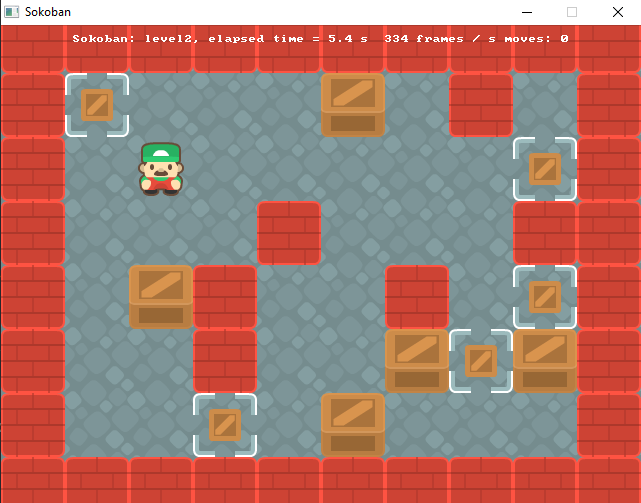
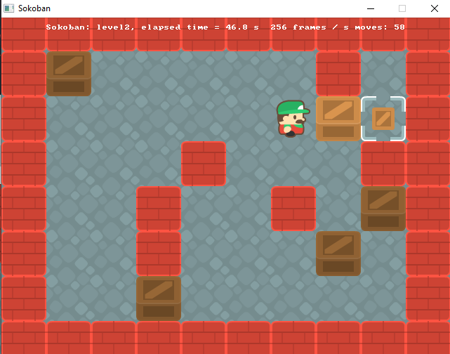

<div id="top"></div>

# Sokoban game

<!-- TABLE OF CONTENTS -->
<details>
  <summary>Table of Contents</summary>
  <ol>
    <li>
      <a href="#about-the-project">About The Project</a>
      <ul>
        <li><a href="#goal-of-game">Goal of game</a></li>
        <li><a href="#built-with">Built With</a></li>
      </ul>
    </li>
    <li>
      <a href="#getting-started">Getting Started</a>
      <ul>
        <li><a href="#prerequisites">Prerequisites</a></li>
        <li><a href="#installation">Installation</a></li>
      </ul>
    </li>
    <li><a href="#usage">Usage</a></li>
    <li><a href="#roadmap">Roadmap</a></li>
    <li><a href="#contributing">Contributing</a></li>
    <li><a href="#license">License</a></li>
    <li><a href="#acknowledgments">Acknowledgments</a></li>
  </ol>
</details>


<!-- ABOUT THE PROJECT -->
## About The Project

<!-- screenshot -->

This was a college project, to implement own version of classic [sokoban](https://en.wikipedia.org/wiki/Sokoban) game. To achive GUI utility, SDL library was used with given template.


### Goal of game
push all crates to designated places in the least amount of moves.


<p align="right">(<a href="#top">back to top</a>)</p>


### Built With
This project was built with 
* [cmake](https://cmake.org/)
* [SDL](https://www.libsdl.org/)


<p align="right">(<a href="#top">back to top</a>)</p>


<!-- GETTING STARTED -->
## Getting Started

To get a local copy up and running follow these simple example steps.

### Prerequisites

This is an example of how to list things you need to use the software and how to install them.
* SDL
* CMake

### Installation

1. Download and compile [SDL](https://www.libsdl.org/download-2.0.php).
2. Download and setup [cmake](https://cmake.org/download/)
3. Clone the repo & change directory
   ```sh
   git clone https://github.com/Percival33/sokoban.git
   cd sokoban
   ```
4. Move SDL folder to sokoban directory & rename it to `SDL2`
5. Create `build` directory
   ```sh
   mkdir build
   cd build
   ```
6. Run cmake to compile project
   ```sh
   cmake ../.
   cmake --build .
   ```
7. Start game
   ```sh
   ./sokoban
   ```

<p align="right">(<a href="#top">back to top</a>)</p>


<!-- USAGE EXAMPLES -->
## Usage

To start game, run the program. Then use arrow keys to move around board. To push crate you need to move player onto crate's position.

### Keyboard shortcuts:
* `ESC` to end game
* `n` to restart game
* `arrow keys` to move around





<p align="right">(<a href="#top">back to top</a>)</p>


<!-- ROADMAP -->
## Roadmap
- [x] Add images
- [x] about project section
- [ ] Add Changelog
- [ ] Add logo
- [ ] finish installation section
- [ ] Update Usage section

See the [open issues](https://github.com/Percival33/sokoban/issues) for a full list of proposed features (and known issues).

<p align="right">(<a href="#top">back to top</a>)</p>


<!-- CONTRIBUTING -->
## Contributing

Contributions are what make the open source community such an amazing place to learn, inspire, and create. Any contributions you make are **greatly appreciated**.

If you have a suggestion that would make this better, please fork the repo and create a pull request. You can also simply open an issue with the tag "enhancement".
Don't forget to give the project a star! Thanks again!

1. Fork the Project
2. Create your Feature Branch (`git checkout -b feature/AmazingFeature`)
3. Commit your Changes (`git commit -m 'Add some AmazingFeature'`)
4. Push to the Branch (`git push origin feature/AmazingFeature`)
5. Open a Pull Request

<p align="right">(<a href="#top">back to top</a>)</p>


<!-- LICENSE -->
## License

Distributed under the MIT License. See `LICENSE.txt` for more information.

<p align="right">(<a href="#top">back to top</a>)</p>


<!-- ACKNOWLEDGMENTS -->
## Acknowledgments

Use this space to list resources you find helpful and would like to give credit to. I've included a few of my favorites to kick things off!

* [Assets author - Kenny](https://www.kenney.nl)
* [readme template](https://github.com/othneildrew/Best-README-Template)

<p align="right">(<a href="#top">back to top</a>)</p>


<!-- MARKDOWN LINKS & IMAGES -->
<!-- https://www.markdownguide.org/basic-syntax/#reference-style-links -->
[starting-position-screenshot]: images/start_position.png
[last-postion-screenshot]: images/last_chest.png
